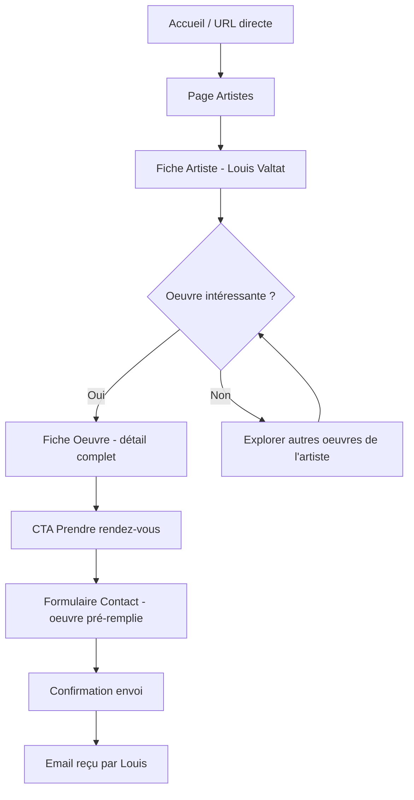
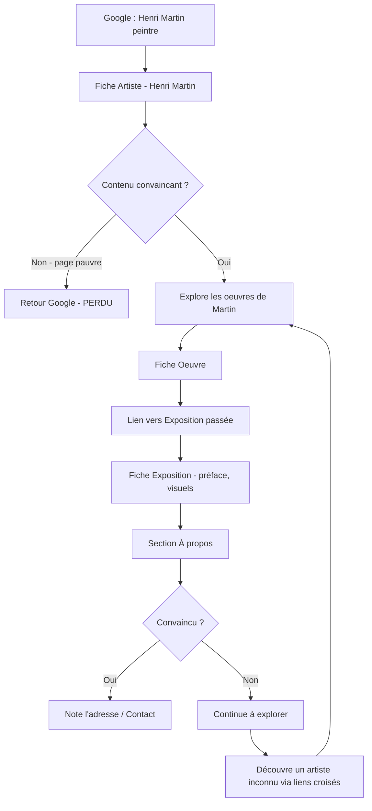
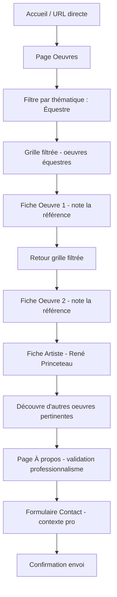

# UX Design Specification GallerieLouisBarrand

**Author:** Marceau
**Date:** 2026-02-25

---

<!-- UX design content will be appended sequentially through collaborative workflow steps -->

## Executive Summary

### Project Vision

Site vitrine pour la Galerie Louis Barrand, galerie d'art parisienne spécialisée dans la redécouverte d'artistes oubliés du XIXe et XXe siècle. L'expérience doit refléter l'identité intimiste du lieu physique : sobre, professionnelle, centrée sur l'art. Le site sert de vitrine permanente entre les salons et expositions, attirant de nouveaux acheteurs via le SEO et facilitant la prise de contact.

### Target Users

- **Collectionneurs** (Sophie) : connaissent la galerie, cherchent des oeuvres précises, veulent aller vite vers le contact. Desktop principalement.
- **Amateurs d'art** (Thomas) : arrivent via Google, ne connaissent pas la galerie, doivent être convaincus par la profondeur du contenu. Mobile et desktop.
- **Professionnels du luxe** (Claire) : brief précis, besoin de scanner le catalogue par thématique efficacement. Desktop.
- **Journalistes** (Marc) : accès rapide à la presse et au contact. Desktop.
- **Administrateur** (Louis) : gestion du contenu via CMS Strapi, pas très à l'aise avec le numérique.

### Key Design Challenges

1. **L'art au centre** — le design ne doit jamais concurrencer les oeuvres. Interface sobre qui met en valeur les visuels sans bruit visuel.
2. **Navigation multi-entrées** — les visiteurs arrivent avec des intentions très différentes. Chaque point d'entrée doit mener naturellement au reste du contenu.
3. **Crédibilité immédiate** — inspirer confiance dès les premières secondes. Le site doit positionner la galerie comme un acteur sérieux du marché de l'art parisien.

### Design Opportunities

1. **Richesse des liens entre contenus** — les relations artiste ↔ oeuvre ↔ expo ↔ thématique créent un parcours de découverte naturel qui retient les visiteurs.
2. **Mobile comme porte d'entrée SEO** — la fiche artiste mobile est souvent la première impression. Opportunité de soigner particulièrement cette page.
3. **Formulaire contextuel** — pré-remplir la référence oeuvre/expo réduit la friction et augmente la qualité des demandes.

## Core User Experience

### Defining Experience

L'expérience centrale du site est : **voir une oeuvre et avoir envie de contacter Louis**. Tout le design sert ce tunnel de conversion : découverte → conviction → contact. Le site n'est pas un e-commerce ni un catalogue froid — c'est une invitation à la rencontre, prolongement numérique de l'intimité de la galerie physique.

### Platform Strategy

- **Web responsive** : desktop-first pour le design (collectionneurs, professionnels), mobile-optimisé pour le SEO (amateurs arrivant via Google)
- **Interaction principale** : souris/clavier sur desktop, touch sur mobile
- **Pas d'app native, pas d'offline** — site statique SSG
- **Appareil critique** : le mobile est la porte d'entrée SEO, la fiche artiste/oeuvre mobile doit être irréprochable

### Effortless Interactions

1. **Navigation entre entités** — passer d'un artiste à ses oeuvres, d'une oeuvre à son exposition, d'une expo aux artistes, sans jamais se sentir perdu. Les liens croisés doivent être naturels et omniprésents.
2. **Le passage à l'action** — le CTA "Prendre rendez-vous" doit être visible sans être agressif. Présent sur chaque fiche oeuvre, il mène au formulaire en pré-remplissant la référence. Zéro friction.
3. **Le chargement des images** — les visuels d'oeuvres sont le coeur du site. Ils doivent s'afficher instantanément en qualité optimale. Un chargement lent trahit le contenu.

### Critical Success Moments

1. **La première impression** — un visiteur arrivant de Google sur une fiche artiste doit immédiatement percevoir le sérieux et la qualité de la galerie. Design sobre, contenu riche, images impeccables.
2. **Le moment "je veux cette oeuvre"** — la fiche oeuvre doit créer le désir. Visuel grand format, informations complètes (technique, dimensions, provenance), et le CTA qui transforme l'envie en action.
3. **L'exploration naturelle** — le visiteur découvre un artiste qu'il ne connaissait pas via les liens croisés. Ce moment de sérendipité est ce qui distingue un bon site de galerie.

### Experience Principles

1. **L'art d'abord** — chaque décision de design se pose la question : "est-ce que ça met l'oeuvre en valeur ou est-ce que ça la concurrence ?"
2. **Sobre mais pas froid** — le design est minimal mais chaleureux. L'espace blanc n'est pas du vide, c'est un écrin.
3. **Tout mène au contact** — sans être intrusif, chaque parcours converge naturellement vers la possibilité de contacter Louis.
4. **La profondeur invite à rester** — les liens entre contenus créent un parcours de découverte qui retient le visiteur et construit la confiance.

### Enseignements des sites de référence

- **Galerie La Ménagerie** : design aéré qui laisse respirer les oeuvres, navigation claire
- **Amélie du Chalard** : espace blanc généreux, grille visuelle efficace, nouveautés en avant
- **Stéphane Renard Fine Art** : contenu contextuel riche autour des oeuvres
- **À éviter** : CTA redondants (Amélie), e-commerce visible (La Ménagerie), manque de filtrage (Stéphane Renard)

## Desired Emotional Response

### Primary Emotional Goals

- **Curiosité et confiance** à l'arrivée — "c'est beau, c'est sérieux, je suis au bon endroit"
- **Contemplation et découverte** pendant l'exploration — le même sentiment qu'en entrant dans une galerie physique
- **Respect et intérêt** à la lecture des contenus — "ce galeriste connaît vraiment ses artistes"
- **Sérénité** au moment du contact — écrire à quelqu'un qui va réellement répondre, pas remplir un formulaire administratif

### Emotional Journey Mapping

| Étape | Émotion visée | Levier UX |
|---|---|---|
| Arrivée (Google/direct) | Curiosité + Confiance | Design sobre, images impeccables, contenu riche visible immédiatement |
| Exploration catalogue | Contemplation + Sérendipité | Espaces blancs, rythme lent, liens croisés entre entités |
| Fiche oeuvre | Désir + Conviction | Visuel grand format, infos complètes, CTA discret mais présent |
| Fiche artiste | Intérêt + Respect | Biographie approfondie, contexte artistique, oeuvres associées |
| Contact | Sérénité + Confiance | Formulaire simple, ton humain, confirmation chaleureuse |
| Retour sur le site | Familiarité + Nouveauté | Nouveautés en accueil, contenu qui évolue |

### Micro-Emotions

- **Confiance > Scepticisme** — contenu riche, design professionnel, Prix Marcus visible, parcours de Louis Barrand
- **Contemplation > Empressement** — espaces blancs généreux, rythme visuel lent, aucun pop-up ni interruption
- **Sérendipité > Routine** — les liens croisés artiste ↔ oeuvre ↔ expo créent des découvertes inattendues

### Emotions to Avoid

- **Froideur commerciale** — on n'est pas sur un marketplace, pas de prix affichés, pas de "ajouter au panier"
- **Confusion** — navigation claire, on sait toujours où on est
- **Impatience** — images rapides, pas de chargement visible
- **Doute sur la légitimité** — design professionnel, jamais amateur

### Emotional Design Principles

1. **L'écrin** — l'espace blanc et le minimalisme ne sont pas du vide, ils créent un environnement de contemplation
2. **Le rythme de galerie** — le site se parcourt lentement, comme on déambule dans une exposition. Pas de scroll infini agressif, pas d'animations tape-à-l'oeil
3. **L'humain derrière le site** — Louis n'est pas une institution anonyme, c'est un galeriste passionné. Le ton, le formulaire, la page À propos doivent transmettre cette humanité
4. **La surprise cultivée** — les liens entre contenus sont des invitations à la découverte, pas des obligations de navigation

## UX Pattern Analysis & Inspiration

### Inspiring Products Analysis

**Fondation Beyeler** (fondationbeyeler.ch) — musée d'art suisse. Navigation épurée, visuels plein écran, espace blanc généreux. Le contenu textuel est toujours secondaire par rapport à l'image. Pattern clé : l'image comme point d'entrée, le texte comme accompagnement.

**Artsy** (artsy.net) — plateforme art en ligne. Fiches oeuvres avec hiérarchie visuelle claire : image dominante, métadonnées en sidebar. Liens croisés très naturels entre artiste, oeuvre, exposition, galerie. Pattern clé : la navigation relationnelle — chaque entité est un hub vers les autres.

**Aesop** (aesop.com) — luxe / cosmétique. Minimalisme radical, typographie serif élégante, noir et blanc avec accents subtils. Rythme de scroll lent et délibéré. Pattern clé : le rythme contemplatif — peu d'éléments par écran, chacun respire.

**Sites de référence de Louis :**
- **Galerie La Ménagerie** : design aéré, navigation claire (Artistes/Oeuvres/Expositions), images haute qualité
- **Amélie du Chalard** : espace blanc généreux, grille visuelle efficace, section "Nouveautés" en avant
- **Stéphane Renard Fine Art** : contenu contextuel riche autour des oeuvres, bilingue FR/EN

### Transferable UX Patterns

**Navigation :**
- Navigation fixe minimale — header sticky avec logo + 6 liens + CTA contact discret. Disparaît au scroll descendant, réapparaît au scroll montant.
- Breadcrumbs contextuels sur les fiches détail (Artistes > Louis Valtat > Paysage du Midi).
- Liens croisés en bas de chaque fiche : "Oeuvres de cet artiste", "Expositions liées".

**Présentation des oeuvres :**
- Grille asymétrique respectant les proportions réelles des oeuvres (pas de recadrage carré).
- Fiche oeuvre en split layout — image à gauche (60-70%), métadonnées à droite.
- Lightbox sobre sur fond noir pour les visuels en plein écran.

**Page d'accueil :**
- Hero sobre — une oeuvre phare en grand format, pas de carrousel automatique.
- Section "Dernières acquisitions" — grille de 6-8 oeuvres.
- Texte d'introduction minimal — une phrase maximum, l'art parle de lui-même.

**Interaction :**
- Transitions douces entre pages (fade léger).
- Hover révélateur — au survol d'une carte, titre et artiste en overlay léger.

### Anti-Patterns to Avoid

- **Carrousel automatique** — l'utilisateur n'a pas le contrôle, crée de l'empressement
- **Grille uniforme carrée** — recadrer les oeuvres trahit l'art, les proportions originales doivent être respectées
- **Sidebar filtres à gauche** — pattern e-commerce qui crée une impression de catalogue commercial
- **Pop-ups newsletter** — interruption agressive, contraire à la sérénité
- **Animations de scroll complexes** (parallax, reveal) — divertit l'attention de l'art
- **Footer massif** — un footer léger suffit : adresse, horaires, liens essentiels, réseaux sociaux

### Design Inspiration Strategy

**À adopter :**
- Split layout pour les fiches oeuvres (image dominante + métadonnées)
- Navigation fixe minimale avec comportement hide/show au scroll
- Grille respectant les proportions des oeuvres
- Liens croisés en bas de chaque fiche détail
- Lightbox sobre sur fond noir pour les visuels

**À adapter :**
- Chips/tags de filtrage (pattern e-commerce) → version sobre et discrète pour les thématiques
- Hero de page d'accueil → une oeuvre phare plutôt qu'un carrousel

**À éviter :**
- Tout ce qui sent le marketplace (grille uniforme, filtres latéraux, prix)
- Tout ce qui interrompt la contemplation (pop-ups, carrousel auto, animations lourdes)
- Tout ce qui surcharge (footer massif, trop de CTA, trop de texte en accueil)

## Design System Foundation

### Design System Choice

**Custom Design System** basé sur CSS natif moderne (custom properties, nesting), sans framework CSS. Styles scopés par composant (natif Astro et Vue).

### Rationale for Selection

- L'identité visuelle de la galerie (noir/blanc, Abhaya Libre, sobriété) ne correspond à aucun design system existant
- Le volume de composants est modeste (~15 composants) — un system custom est maintenable
- Développeur unique (Marceau) — pas de courbe d'apprentissage d'un framework à gérer
- CSS natif moderne couvre tous les besoins (custom properties pour les tokens, nesting pour la lisibilité, container queries si besoin)
- Cohérent avec la décision architecture (pas de framework CSS)

### Implementation Approach

**Design Tokens** (dans `src/styles/global.css`) :
- Couleurs : noir (#1a1a1a), blanc (#fafafa), gris intermédiaires pour la hiérarchie
- Typographie : Abhaya Libre (titres/corps), tailles et line-heights
- Espacements : échelle cohérente (4px, 8px, 16px, 24px, 32px, 48px, 64px, 96px)
- Breakpoints : mobile (320px), tablette (768px), desktop (1024px), large (1440px)
- Transitions : durée et easing par défaut pour les interactions

**Composants réutilisables** :
- CarteOeuvre, CarteArtiste, CarteExposition — les 3 cartes de base
- SeoHead — meta/OG/schema.org
- GalerieImages — grille asymétrique
- LayoutPrincipal, Header, Nav, Footer — structure

### Customization Strategy

- Les tokens sont les seules variables globales — tout le reste est scopé
- Chaque composant contient ses propres styles via `<style>` (Astro) ou `<style scoped>` (Vue)
- Les composants carte (Oeuvre, Artiste, Expo) partagent un pattern visuel commun mais restent indépendants
- Le responsive est géré composant par composant, pas globalement

## Defining Core Experience

### Defining Experience

**"Voir une oeuvre et avoir envie de contacter Louis."**

C'est l'équivalent numérique du moment où un visiteur s'arrête devant une toile dans la galerie, se retourne vers Louis et dit "parlez-moi de cette pièce". Le site doit recréer cette simplicité.

### User Mental Model

Le visiteur apporte un modèle mental existant : découvrir → évaluer → contacter. C'est le parcours naturel dans le monde de l'art, que ce soit en salon, sur Proantic ou via le bouche-à-oreille.

**Ce que le site reproduit :**
- **Découvrir** — parcourir les artistes et oeuvres comme on déambule dans une galerie
- **Évaluer** — juger la crédibilité (profondeur du contenu, expos passées, Prix Marcus, parcours de Louis)
- **Contacter** — écrire à Louis comme on l'aborderait en galerie

**Ce que le site améliore :**
- Disponible 24h/24, accessible de n'importe où
- Navigation par thématique (impossible dans une galerie physique)
- Liens croisés qui créent des découvertes (sérendipité augmentée)
- Le visiteur peut prendre son temps sans pression sociale

### Success Criteria

Le visiteur dit "ça marche" quand :
- Il trouve une oeuvre qui l'intéresse en moins de 3 clics
- Il comprend immédiatement qui est l'artiste et pourquoi cette oeuvre est intéressante
- Il peut contacter Louis sans effort, en sachant que sa demande sera contextualisée (référence oeuvre pré-remplie via paramètre URL)
- Il reçoit une confirmation qui le rassure ("votre message a été envoyé, Louis vous répondra rapidement")

### Pattern Analysis

**Patterns établis** — on n'innove pas sur les interactions, on perfectionne l'exécution :
- Liste → Fiche détail → Action (pattern catalogue classique)
- Grille d'images cliquables (pattern galerie photo)
- Formulaire de contact (pattern universel)
- Navigation principale fixe (pattern web standard)

**Notre twist :** la richesse des liens croisés et le pré-remplissage contextuel du formulaire (via paramètre URL `/contact?oeuvre=slug`). Pas besoin d'éduquer l'utilisateur — il sait déjà naviguer un site, on rend juste l'expérience plus fluide et plus riche.

### Experience Mechanics

**1. Initiation — L'entrée dans la galerie**
- Le visiteur arrive via Google (fiche artiste), lien direct (accueil), ou navigation interne (depuis une expo, un artiste)
- Chaque page d'atterrissage doit fonctionner comme une entrée autonome — pas de dépendance à un parcours linéaire
- Le header avec navigation est toujours visible — le visiteur sait immédiatement où il est et où il peut aller

**2. Interaction — La déambulation**
- Le visiteur parcourt les oeuvres (grille asymétrique, proportions respectées)
- Il clique sur une oeuvre — la fiche s'ouvre en split layout (image dominante + métadonnées)
- Il explore les liens : artiste, exposition, thématique
- À chaque étape, le CTA "Prendre rendez-vous" est présent mais discret

**3. Feedback — La réassurance**
- Les images se chargent instantanément (SSG + optimisation Astro)
- Les liens croisés montrent la profondeur du catalogue
- Le contenu riche (biographies, contexte) construit la crédibilité
- La navigation est prévisible — pas de surprise désagréable

**4. Completion — Le contact**
- Le visiteur clique "Prendre rendez-vous" depuis une fiche oeuvre
- Le formulaire s'ouvre avec la référence pré-remplie
- Il remplit nom, email, message — 30 secondes maximum
- Confirmation claire et chaleureuse
- Louis reçoit un email avec tout le contexte

## Visual Design Foundation

### Color System

**Palette principale :**
- Fond : ivoire chaud `#FAF8F5` (murs de galerie)
- Texte principal : noir profond `#1A1A1A`
- Texte secondaire : gris foncé `#4A4A4A` (métadonnées, légendes)
- Texte tertiaire : gris moyen `#7A7A7A` (dates, infos techniques)
- Bordures/séparateurs : gris clair `#E5E2DE` (teinte chaude cohérente)
- Fond alternatif : blanc `#FFFFFF` (cartes, formulaire — contraste léger avec le fond ivoire)
- Noir plein `#000000` (footer, lightbox fond)

**Couleurs fonctionnelles :**
- CTA (Prendre rendez-vous) : `#1A1A1A` fond + `#FAF8F5` texte (bouton noir sobre, inversé au hover)
- Succès (confirmation formulaire) : `#2D6A4F` (vert discret)
- Erreur (validation formulaire) : `#C1292E` (rouge sobre)
- Focus clavier : `#1A1A1A` outline 2px (accessibilité)

**Principe :** pas de couleur vive. La seule couleur sur le site vient des oeuvres elles-mêmes.

### Typography System

**Titres : Abhaya Libre** (serif, Google Fonts)
- h1 : 2.5rem / line-height 1.2 / font-weight 700
- h2 : 2rem / line-height 1.25 / font-weight 700
- h3 : 1.5rem / line-height 1.3 / font-weight 600
- h4 : 1.25rem / line-height 1.35 / font-weight 600

**Corps : Inter** (sans-serif, Google Fonts)
- Body : 1rem (16px) / line-height 1.6 / font-weight 400
- Small : 0.875rem / line-height 1.5 / font-weight 400
- Caption : 0.75rem / line-height 1.4 / font-weight 400
- Body bold : font-weight 500 (pas 700 — subtil)

**Principe typographique :** Abhaya Libre donne le caractère (classique, art), Inter s'efface et sert la lisibilité. Le contraste serif/sans-serif crée la hiérarchie naturellement.

### Spacing & Layout Foundation

**Échelle d'espacements :**
- `--space-xs`: 4px
- `--space-sm`: 8px
- `--space-md`: 16px
- `--space-lg`: 24px
- `--space-xl`: 32px
- `--space-2xl`: 48px
- `--space-3xl`: 64px
- `--space-4xl`: 96px

**Layout :**
- Largeur max contenu : 1280px, centré
- Marges latérales : 24px (mobile), 48px (tablette), auto (desktop)
- Grille oeuvres : CSS Grid, colonnes auto-fill, gap 24px
- Split layout fiche oeuvre : 60% image / 40% métadonnées (desktop), empilé sur mobile

**Breakpoints :**
- Mobile : < 768px
- Tablette : 768px — 1023px
- Desktop : 1024px — 1439px
- Large : ≥ 1440px

**Transitions :**
- Durée par défaut : 200ms
- Easing : ease-in-out
- Hover cartes : opacity 0.8 → 1 (subtil)
- Fade page : 150ms

### Accessibility Considerations

- Contraste texte `#1A1A1A` sur fond `#FAF8F5` : ratio 15.4:1 (WCAG AAA)
- Contraste texte secondaire `#4A4A4A` sur `#FAF8F5` : ratio 8.5:1 (WCAG AAA)
- Contraste texte tertiaire `#7A7A7A` sur `#FAF8F5` : ratio 4.2:1 (WCAG AA — minimum pour le small text)
- Focus visible sur tous les éléments interactifs (outline 2px noir)
- Taille minimum de texte : 14px (0.875rem)
- Zones cliquables minimum : 44x44px (touch target)
- Logo : `spec/Logo_Gallerie_LouisBarrand.svg` (vectoriel, header + favicon) et `spec/Logo_Gallerie_LouisBarrand.jpeg` (bitmap, Open Graph)

## Design Direction Decision

### Design Directions Explored

Deux directions comparées pour chaque composant clé via mockups HTML interactifs (ux-design-directions.html). Les choix portent sur le header, la page d'accueil, la grille d'oeuvres et la fiche oeuvre.

### Chosen Direction

**Header : classique (A)** — logo à gauche, navigation à droite. Efficace, pas de place perdue, pattern reconnu.

**Page d'accueil : sobre (B)** — titre, séparateur, phrase d'accroche. Pas de hero immersif. L'art parle de lui-même, la section "Dernières acquisitions" prend le relais visuellement.

**Grille oeuvres : asymétrique (A)** — proportions variées respectant les oeuvres, overlay au hover (titre + artiste). Plus vivante qu'une grille uniforme, fidèle au principe "l'art d'abord".

**Fiche oeuvre : split layout (A)** — image 60% à gauche, métadonnées 40% à droite. L'image domine, les infos accompagnent. CTA "Prendre rendez-vous" visible sans scroller. Empilé sur mobile.

**Formulaire : direction unique** — champs simples, référence oeuvre pré-remplie via URL, bouton sobre.

**Footer : léger** — 3 colonnes (adresse, horaires, liens externes). Pas de footer massif.

### Design Rationale

Cohérence avec les principes UX établis :
- "L'art d'abord" → grille asymétrique, accueil sobre, split layout
- "Sobre mais pas froid" → overlay hover doux, ivoire chaud, typographie classique
- "Tout mène au contact" → CTA visible sur fiche oeuvre sans scroller, nav contact toujours accessible
- "La profondeur invite à rester" → liens croisés en bas des fiches, grille qui invite à explorer

### Implementation Notes

- Le header devient sticky avec hide/show au scroll (disparaît au scroll descendant, réapparaît au montant)
- La grille asymétrique utilise CSS Grid avec grid-row/column span pour les oeuvres mises en avant
- Le split layout de la fiche oeuvre passe en empilé (image puis métadonnées) sur mobile < 768px
- L'overlay hover de la grille est remplacé par l'info visible en permanence sur mobile (pas de hover sur touch)

## User Journey Flows

### Parcours 1 : Recherche ciblée (Sophie, collectionneuse)

Sophie connaît la galerie. Elle cherche une oeuvre d'un artiste précis.

**Points critiques UX :**
- La fiche artiste doit afficher ses oeuvres immédiatement (pas besoin de cliquer un onglet)
- Le CTA est visible sans scroller sur la fiche oeuvre (split layout)
- Le formulaire arrive pré-rempli — Sophie ne tape que nom, email, message

**Nombre de clics : 3** (Artistes → Valtat → Oeuvre → CTA = 3 clics vers le formulaire depuis l'accueil)

### Parcours 2 : Découverte SEO (Thomas, amateur d'art)

Thomas ne connaît pas la galerie. Il arrive via Google sur une fiche artiste.

**Points critiques UX :**
- La fiche artiste est la PREMIÈRE impression — elle doit être irréprochable (bio riche, visuels, oeuvres)
- Les liens croisés (expo, artistes liés) sont le moteur de l'exploration — ils doivent être naturels et visibles
- La page À propos (Prix Marcus, parcours) est le "closer" de crédibilité
- Sur mobile : tout doit être aussi fluide (entrée SEO = souvent mobile)

### Parcours 3 : Brief professionnel (Claire, directrice artistique)

Claire a un brief précis (thème équestre). Elle scanne le catalogue efficacement.

**Points critiques UX :**
- Le filtrage par thématique doit être immédiat (pas de rechargement) et visible dès l'arrivée sur /oeuvres
- Le retour à la grille filtrée après consultation d'une fiche doit conserver le filtre actif
- Claire consulte plusieurs oeuvres — la navigation retour doit être fluide (breadcrumbs, bouton retour)

### Journey Patterns

**Navigation relationnelle :**
- Chaque fiche (artiste, oeuvre, expo) est un hub vers les entités liées
- Les liens croisés sont en bas de fiche, dans une section dédiée
- Le visiteur ne se retrouve jamais dans un cul-de-sac

**Filtrage conservé :**
- Quand un filtre est actif (thématique), il persiste lors de la navigation retour
- Le filtre actif est visible comme chip sélectionnée

**CTA progressif :**
- Le CTA "Prendre rendez-vous" apparaît sur les fiches oeuvres (moment du désir)
- Le lien "Contact" est toujours dans la nav (filet de sécurité)
- Le formulaire est pré-rempli quand on vient d'une oeuvre/expo

### Flow Optimization Principles

1. **Zéro cul-de-sac** — chaque page propose au moins 2 sorties (entité liée + nav principale)
2. **Contexte préservé** — le filtre actif, la page d'origine, la référence oeuvre sont maintenus dans la navigation
3. **Mobile = première impression** — le parcours Thomas (SEO) commence souvent sur mobile, chaque page doit être complète et belle sur petit écran
4. **3 clics max vers le contact** — depuis n'importe quelle page du site

## Component Strategy

### Design System Components

**Custom Design System en CSS natif** — pas de framework ni bibliothèque de composants pré-existante. Tous les composants sont créés sur mesure, le volume reste modeste (~16 composants).

**Composants identifiés depuis les user journeys et le design :**

| Composant | Type | Source du besoin |
|---|---|---|
| Header (sticky, hide/show) | Astro | Navigation — toutes les pages |
| Nav | Astro | Navigation + CTA Contact |
| Footer | Astro | Toutes les pages |
| LayoutPrincipal | Astro | Structure de page |
| CarteOeuvre | Astro | Grille oeuvres, accueil (dernières acquisitions) |
| CarteArtiste | Astro | Page artistes |
| CarteExposition | Astro | Page expositions |
| FicheOeuvre (split layout) | Astro | Parcours Sophie, Thomas, Claire |
| GalerieImages (grille asymétrique) | Astro | Pages listing oeuvres |
| FormulaireContact | Vue island | Parcours contact (pré-remplissage URL) |
| SeoHead | Astro | Toutes les pages (meta, OG, schema.org) |
| Lightbox | Vue island | Fiche oeuvre — zoom plein écran |
| ChipThematique | Vue island | Filtrage oeuvres par thématique |
| Breadcrumb | Astro | Fiches détail |
| SectionLiensRelies | Astro | Bas des fiches (liens croisés) |
| ConfirmationMessage | Vue island | Après envoi formulaire |

### Custom Components

**Header**
- **Purpose :** Navigation principale + identité de la galerie
- **Anatomy :** Logo `spec/Logo_Gallerie_LouisBarrand.svg` (gauche) + Nav links (droite) + CTA Contact
- **States :** visible, hidden (scroll descendant), revealed (scroll montant)
- **Variants :** desktop (horizontal), mobile (burger → menu plein écran)
- **Accessibility :** nav landmark, skip-to-content, focus management dans le menu mobile
- **Interaction :** sticky, disparaît au scroll down, réapparaît au scroll up

**CarteOeuvre**
- **Purpose :** Aperçu visuel d'une oeuvre dans une grille
- **Content :** Image (proportions réelles), titre, artiste
- **States :** default (image seule), hover (overlay titre + artiste), focus (outline)
- **Variants :** standard, mise en avant (grid-span 2), mobile (info visible sans hover)
- **Accessibility :** alt text complet, lien couvrant toute la carte, focus visible
- **Interaction :** hover → overlay doux (opacity), click → fiche oeuvre

**CarteArtiste**
- **Purpose :** Aperçu d'un artiste dans la liste
- **Content :** Portrait/oeuvre représentative, nom, dates, courte bio
- **States :** default, hover (légère élévation), focus
- **Accessibility :** alt text, lien englobant, focus visible

**CarteExposition**
- **Purpose :** Aperçu d'une exposition
- **Content :** Visuel principal, titre, dates, lieu
- **States :** default, hover, focus. Badge "En cours" si applicable
- **Accessibility :** alt text, dates lisibles par lecteur d'écran

**FicheOeuvre (split layout)**
- **Purpose :** Page détail — le moment du désir
- **Anatomy :** Image 60% (gauche) + Métadonnées 40% (droite : titre, artiste, technique, dimensions, date, thématiques, CTA)
- **States :** desktop (côte à côte), mobile (empilé), lightbox ouverte
- **Interaction :** Click image → lightbox fond noir, CTA → /contact?oeuvre=slug

**GalerieImages (grille asymétrique)**
- **Purpose :** Affichage de la collection d'oeuvres
- **Content :** Collection de CarteOeuvre en CSS Grid
- **States :** non filtrée, filtrée par thématique
- **Interaction :** Chips thématiques en haut, grille se filtre sans rechargement
- **Technique :** CSS Grid avec auto-fill, certaines oeuvres en span 2

**FormulaireContact (Vue island)**
- **Purpose :** Prise de contact avec Louis
- **Content :** Champs : nom, email, message, référence oeuvre (pré-rempli via URL param)
- **States :** vide, rempli, validation en cours, erreur (champs), succès (confirmation)
- **Accessibility :** labels associés, aria-describedby pour erreurs, focus piégé dans le formulaire, annonce succès
- **Interaction :** Soumission → API Strapi → email Brevo → message confirmation

**Lightbox (Vue island)**
- **Purpose :** Zoom plein écran sur une oeuvre
- **Content :** Image haute résolution sur fond noir
- **States :** fermée, ouverte
- **Accessibility :** focus trap, fermeture Escape, aria-modal, bouton fermer visible
- **Interaction :** Click image fiche → ouverture, Escape/click extérieur → fermeture

**ChipThematique (Vue island)**
- **Purpose :** Filtre par thématique (paysage, équestre, portrait...)
- **States :** inactive, active (sélectionnée), hover
- **Accessibility :** role button, aria-pressed
- **Interaction :** Click → filtre la grille, re-click → désactive le filtre

**Breadcrumb**
- **Purpose :** Contexte de navigation sur les fiches détail
- **Content :** Fil d'Ariane (ex: Artistes > Louis Valtat > Paysage du Midi)
- **Accessibility :** nav aria-label="Fil d'Ariane", liens sémantiques

**SectionLiensRelies**
- **Purpose :** Liens croisés en bas de chaque fiche
- **Content :** "Oeuvres de cet artiste", "Expositions liées", "Artistes de cette exposition"
- **Variants :** selon le type de fiche (artiste, oeuvre, expo)

**SeoHead**
- **Purpose :** Meta tags, Open Graph, schema.org
- **Content :** title, description, og:image, schema selon le type (ArtGallery, Person, VisualArtwork, ExhibitionEvent)

### Component Implementation Strategy

**Composants fondation (structure) :**
- LayoutPrincipal, Header, Nav, Footer, SeoHead, Breadcrumb

**Composants métier (art) :**
- CarteOeuvre, CarteArtiste, CarteExposition, FicheOeuvre, GalerieImages, SectionLiensRelies

**Composants interaction (Vue islands) :**
- FormulaireContact, Lightbox, ChipThematique, ConfirmationMessage

**Approche :**
- Tous les composants utilisent les design tokens CSS (custom properties)
- Composants Astro pour tout ce qui est statique (cartes, layout, SEO)
- Composants Vue uniquement pour l'interactivité côté client (formulaire, lightbox, filtrage)
- Styles scopés dans chaque composant (`<style>` Astro, `<style scoped>` Vue)
- Pattern visuel partagé pour les 3 cartes (CarteOeuvre, CarteArtiste, CarteExposition) mais sans abstraction prématurée

### Implementation Roadmap

**Phase 1 — Fondations (Epic 1) :**
- LayoutPrincipal, Header, Nav, Footer, SeoHead
- Design tokens (global.css)

**Phase 2 — Contenu artistes & oeuvres (Epic 2) :**
- CarteOeuvre, CarteArtiste, GalerieImages
- FicheOeuvre (split layout), Lightbox
- Breadcrumb, SectionLiensRelies
- ChipThematique (filtrage)

**Phase 3 — Expositions & identité (Epic 3) :**
- CarteExposition
- Pages exposition et à propos

**Phase 4 — Contact & accueil (Epic 4) :**
- FormulaireContact (Vue island)
- ConfirmationMessage
- Page d'accueil (dernières acquisitions)

## UX Consistency Patterns

### Button Hierarchy

**Primaire — CTA "Prendre rendez-vous" :**
- Fond `#1A1A1A`, texte `#FAF8F5`, padding 12px 24px
- Hover : fond `#FAF8F5`, texte `#1A1A1A`, bordure 1px `#1A1A1A`
- Un seul CTA primaire visible par écran
- Utilisé sur : fiche oeuvre, nav (version compacte)

**Secondaire — Liens d'action :**
- Texte `#1A1A1A`, souligné, pas de fond
- Hover : opacity 0.7
- Utilisé pour : "Voir toutes les oeuvres", "Retour à la liste", liens croisés

**Tertiaire — Navigation / Chips :**
- Fond transparent, bordure 1px `#E5E2DE`, texte `#1A1A1A`
- Active : fond `#1A1A1A`, texte `#FAF8F5`
- Utilisé pour : ChipThematique, pagination si nécessaire

**Règle :** pas de couleur vive sur les boutons. Le contraste noir/ivoire suffit.

### Feedback Patterns

**Succès (formulaire envoyé) :**
- Bandeau vert discret `#2D6A4F` avec texte blanc
- Message : "Votre message a été envoyé. Louis vous répondra rapidement."
- Icône check, reste visible (pas de redirection)
- Accessible : `role="status"`, `aria-live="polite"`

**Erreur de validation :**
- Texte rouge `#C1292E` sous le champ concerné
- Bordure du champ passe en `#C1292E`
- Message spécifique : "Veuillez renseigner votre email" (pas de "Erreur !")
- Accessible : `aria-describedby` liant le champ au message d'erreur

**Erreur serveur :**
- Bandeau sobre en haut du formulaire
- Message : "Un problème est survenu. Veuillez réessayer ou contacter directement la galerie."
- Accessible : `role="alert"`

**Chargement :**
- Spinner discret (petit cercle animé en `#1A1A1A`) sur le bouton de soumission
- Bouton désactivé pendant le chargement
- Pas de skeleton screens — le site est SSG, les pages chargent instantanément

**État vide :**
- Si filtrage ne donne aucun résultat : "Aucune oeuvre dans cette thématique pour le moment."
- Ton neutre, pas d'illustration décorative

### Form Patterns

**Structure :**
- Labels au-dessus des champs (jamais en placeholder uniquement)
- Champs pleine largeur sur mobile, 2 colonnes (nom/email) sur desktop
- Champ message : textarea, hauteur minimum 120px
- Référence oeuvre : champ readonly pré-rempli via URL, grisé visuellement

**Validation :**
- Validation côté client au blur (sortie du champ)
- Re-validation au submit
- Champs requis marqués avec astérisque (avec légende "* Champ obligatoire")
- Email : validation format
- Message : minimum 10 caractères

**Soumission :**
- Bouton "Envoyer" (primaire)
- Désactivé pendant l'envoi, pas de double soumission possible
- Succès → message de confirmation (pas de redirection)

**Accessibilité :**
- Tous les champs ont un `<label>` associé
- Erreurs annoncées par `aria-live`
- Navigation Tab logique
- Focus visible sur tous les éléments

### Navigation Patterns

**Header sticky hide/show :**
- Au scroll descendant (> 100px) : le header glisse vers le haut (hidden)
- Au scroll montant : le header réapparaît (transition 200ms ease)
- Position fixe en haut de page
- Z-index élevé, fond `#FAF8F5` avec léger box-shadow au scroll

**Navigation mobile (burger) :**
- Icône hamburger 44x44px (touch target)
- Overlay plein écran fond `#FAF8F5`
- Liens centrés verticalement, Abhaya Libre en grand
- CTA Contact visible en bas
- Fermeture : bouton X, Escape, ou click sur lien
- Focus trap à l'intérieur du menu

**Breadcrumb :**
- Présent uniquement sur les fiches détail (artiste, oeuvre, exposition)
- Format : Artistes > Nom Artiste > Titre Oeuvre
- Dernier élément non cliquable (page courante)
- Taille caption (0.75rem), couleur secondaire `#4A4A4A`

**Liens croisés (SectionLiensRelies) :**
- Toujours en bas de fiche, avant le footer
- Grille horizontale scrollable sur mobile, grille fixe sur desktop
- Maximum 6 éléments affichés, lien "Voir tout" si plus

**Retour après filtrage :**
- Filtre thématique conservé dans l'URL (query param `?thematique=slug`)
- Bouton retour navigateur ramène à la grille filtrée
- Chip actif reste visuellement sélectionné

### Additional Patterns

**Images :**
- Alt descriptif (titre + artiste) sur toutes les images d'oeuvres
- Lazy loading natif (`loading="lazy"`) sauf images above the fold
- Format WebP avec fallback JPEG (optimisation Astro)
- Pas de recadrage — proportions originales respectées

**Lightbox :**
- Fond noir `#000000` opacity 95%
- Image centrée, taille maximale sans déborder
- Fermeture : click extérieur, Escape, bouton X
- Focus trap, `aria-modal="true"`

**Transitions :**
- Fade léger (150ms) entre les pages
- Scroll revient en haut à chaque navigation
- Pas de transition lourde ni d'animation de scroll

**Hover sur cartes :**
- CarteOeuvre : overlay semi-transparent avec titre + artiste (desktop uniquement)
- CarteArtiste / CarteExposition : légère élévation (box-shadow subtile)
- Sur mobile/touch : infos toujours visibles (pas de hover)
- Transition : 200ms ease-in-out

**Focus clavier :**
- Outline 2px `#1A1A1A` avec offset 2px sur tous les éléments interactifs
- Pas de suppression du focus outline
- Ordre de tabulation logique (header → contenu → footer)

## Responsive Design & Accessibility

### Responsive Strategy

**Desktop (≥ 1024px) — L'expérience principale :**
- Split layout fiche oeuvre : image 60% / métadonnées 40% côte à côte
- Grille oeuvres : CSS Grid 3-4 colonnes avec asymétrie (span 2 pour les mises en avant)
- Grille artistes/expos : 3 colonnes
- Header : logo gauche + navigation horizontale + CTA contact
- Largeur max contenu : 1280px centré, marges auto

**Tablette (768px — 1023px) :**
- Split layout : 50/50 ou empilé selon la largeur
- Grille oeuvres : 2 colonnes, asymétrie conservée
- Grille artistes/expos : 2 colonnes
- Header : navigation réduite ou burger selon l'espace
- Marges latérales : 48px
- Touch targets : 44x44px minimum

**Mobile (< 768px) — La porte d'entrée SEO :**
- Split layout : empilé (image en haut, métadonnées en dessous)
- Grille oeuvres : 1 colonne, info visible en permanence (pas d'overlay hover)
- Header : burger menu → overlay plein écran
- Marges latérales : 24px
- CTA "Prendre rendez-vous" : pleine largeur, zone tactile généreuse
- Breadcrumb : simplifié si trop long

**Large (≥ 1440px) :**
- Contenu plafonné à 1280px — pas d'étirement
- Images bénéficient de plus de résolution

### Breakpoint Strategy

**Approche : desktop-first pour le design, mobile-first pour le CSS.**

Le design pense desktop d'abord (collectionneurs, professionnels), mais le CSS utilise des media queries `min-width` pour progresser du mobile vers le desktop.

| Breakpoint | Cible |
|---|---|
| < 768px | Smartphones portrait |
| 768px — 1023px | Tablettes, smartphones paysage |
| 1024px — 1439px | Laptops, desktops |
| ≥ 1440px | Grands écrans |

**Comportements clés :**
- **< 768px** : layout empilé, burger menu, grille 1 col, CTA pleine largeur
- **768px** : grilles 2 cols, split layout possible, navigation horizontale possible
- **1024px** : grilles 3-4 cols, split layout 60/40, header complet
- **1440px** : contenu plafonné à 1280px, marges auto

### Accessibility Strategy

**Niveau cible : WCAG 2.1 AA** (AAA atteint de facto sur les contrastes texte)

**Contrastes :**
- `#1A1A1A` sur `#FAF8F5` : 15.4:1 (AAA)
- `#4A4A4A` sur `#FAF8F5` : 8.5:1 (AAA)
- `#7A7A7A` sur `#FAF8F5` : 4.2:1 (AA — texte small uniquement)

**Structure sémantique :**
- `<header>`, `<nav>`, `<main>`, `<footer>` sur chaque page
- `<article>` pour les fiches (artiste, oeuvre, exposition)
- Headings hiérarchiques (h1 unique par page, h2/h3 en cascade)
- Skip-to-content link en premier élément focusable

**Navigation clavier :**
- Tab : parcourt tous les éléments interactifs dans l'ordre logique
- Escape : ferme lightbox, menu mobile
- Enter/Space : active boutons et liens
- Focus visible (outline 2px `#1A1A1A`, offset 2px) sur tout
- Focus trap dans : lightbox, menu mobile

**Images et alt text :**
- Oeuvres : `alt="[Titre], [Artiste], [Technique], [Date]"`
- Portraits artistes : `alt="Portrait de [Nom Artiste]"`
- Visuels décoratifs : `alt=""`

**Formulaire :**
- Labels explicites liés par `for`/`id`
- Erreurs : `aria-describedby` + `aria-invalid="true"`
- Succès : `aria-live="polite"`
- Référence pré-remplie : `readonly` + `aria-label` explicatif

**Schema.org :** ArtGallery, Person, VisualArtwork, ExhibitionEvent

### Testing Strategy

**Tests responsive :**
- Chrome DevTools : simulation des breakpoints pendant le développement
- Appareils réels : iPhone (Safari), Android (Chrome)
- Navigateurs : Chrome, Firefox, Safari (macOS/iOS), Edge

**Tests accessibilité :**
- Automatisé : axe-core via Lighthouse CI à chaque build
- Manuel : navigation clavier complète (Tab, Escape, Enter)
- Lecteur d'écran : VoiceOver (macOS)
- Score Lighthouse Accessibility ≥ 95
- Zéro violation axe-core critical/serious

### Implementation Guidelines

**CSS responsive :**
- Unités relatives : `rem` pour les tailles, `%` et `fr` pour les layouts
- Media queries `min-width` (mobile-first CSS)
- CSS Grid pour les grilles, Flexbox pour l'alignement
- Container queries si un composant doit s'adapter indépendamment du viewport
- `clamp()` pour la typographie responsive si pertinent

**HTML accessible :**
- Sémantique d'abord — `<button>` pour les actions, `<a>` pour la navigation
- ARIA uniquement quand le HTML natif ne suffit pas
- `lang="fr"` sur `<html>`
- `` avec `alt` systématique, `loading="lazy"` sauf above the fold

**Performance mobile :**
- Images : `srcset` + `sizes` pour servir la bonne résolution
- Fonts : `font-display: swap`
- SSG : HTML pré-rendu, pas de JavaScript bloquant
- Vue islands : hydratation lazy (`client:visible`)
